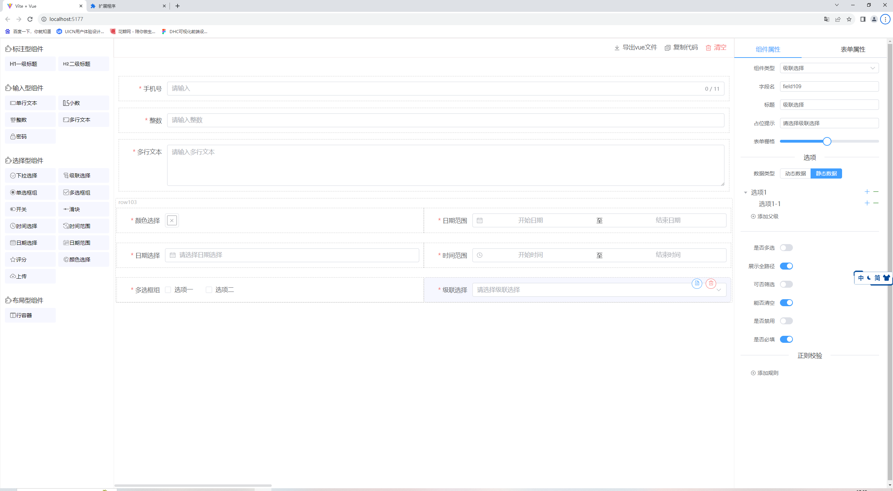
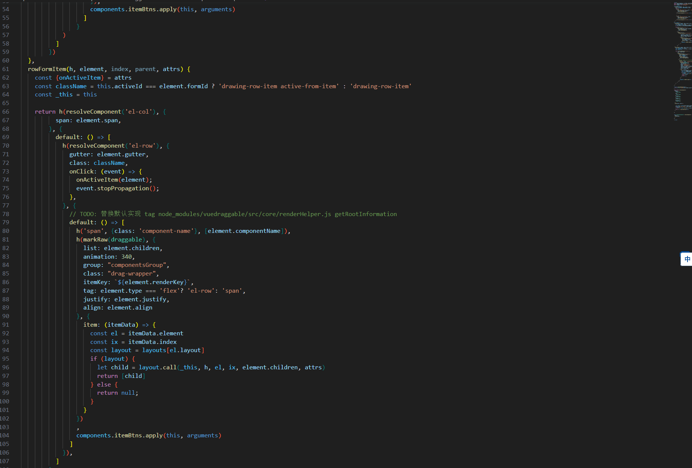

# Vue3 + ElementPlus + Vite 重构 若依Vue2 表单构建功能

若依官方的Vue3 版本发布已经有段时间了，就是这个表单构建功能一直没有安排计划去适配到Vue3！

前段时间公司需要做个类似的功能，就直接借鉴若依Vue2的来直接改了

吐槽下：vuedraggable-vue3 坑真多，官方文档一言难尽，已经不维护了，现在不推荐使用；

[vuedraggable-vue3官方文档](https://www.itxst.com/vue-draggable-next/tutorial.html)

优秀文章：[vite插件注册svg-icon 图标](https://segmentfault.com/a/1190000039255368?utm_source=sf-similar-article)

对该文章再此补充部分

1. 使用插件的形式注入svg到整个dom节点，如下代码
   ```js
   transformIndexHtml(html) {
      return html.replace(
        '<body>',
        `
          <body>
            <svg xmlns="http://www.w3.org/2000/svg" xmlns:xlink="http://www.w3.org/1999/xlink" style="position: absolute; width: 0; height: 0">
              ${res.join('')}
            </svg>
        `,
      );
    },
   ```
2. 可以看到`return html.replace('<body>',` 该代码 `第一个替换参数是 '<body>'` 不能修改body标签，如：`<body >  or  < body>  or < body >` 浏览器都能识别改标签，但是此处不能替换会导致插件替换失效


[Vue3h函数章节](https://cn.vuejs.org/guide/extras/render-function.html#creating-vnodes)
# 项目使用
```json
"clipboard": "^2.0.11", //剪切板
"element-plus": "^2.3.3",
"file-saver": "^2.0.5", //文件下载
"js-beautify": "^1.14.3", //js格式化
"sass": "^1.62.0",
"vue": "^3.3.4",
"vuedraggable": "^4.1.0" //拖拽
```
## 效果截图




## 部分代码

